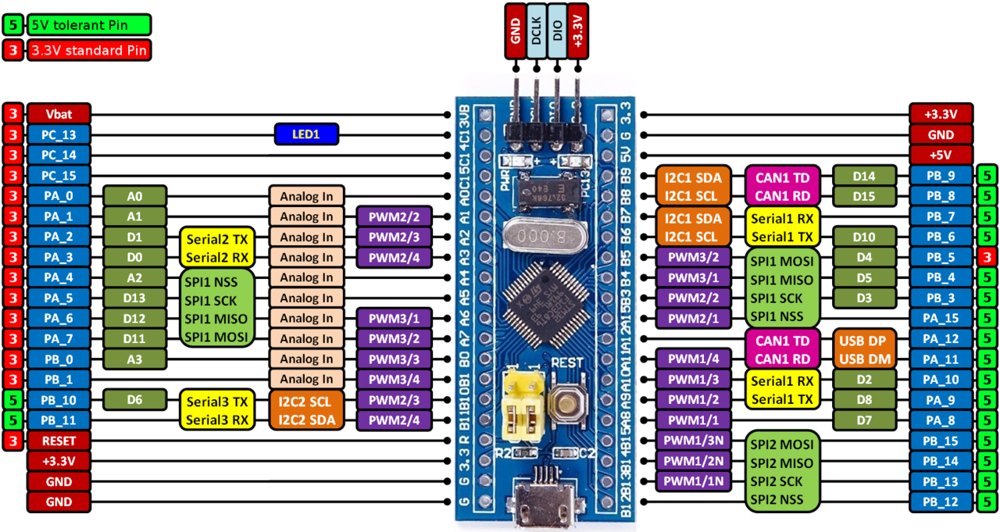

# MICROCONTROLADORES 

## Authors:
  - Alysson Lucas Pontes Cavalcante da Silva
  - Maria Victória Martins Neves

## Descriptions: 

Repositorio criado para armazenar soluções das práticas da disciplina de microcontoladores ministrada pelo professor Jose Neto.

## Práticas:
  - Prática 01 - Assembler utilizando o VisUAL ARMEmulator
  - Prática 02 -
  - Prática 03 -
  - Prática 04 -
  - Prática 05 -  

## Materiais utilizados:

-Microcontrolador utilizado STM32F103C8T6 board, conhecida também pelo apelido de Bluepill

Fonte: https://os.mbed.com/users/hudakz/code/STM32F103C8T6_Hello/

