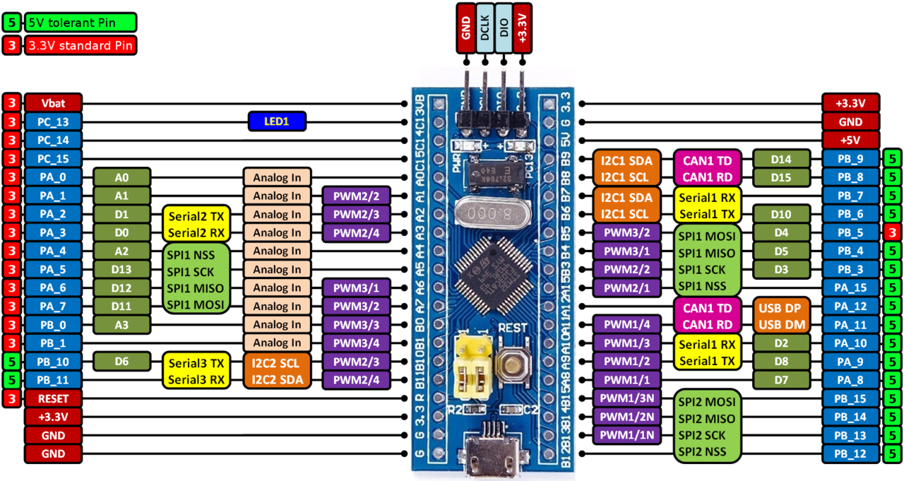

# MICROCONTROLADORES 

## Authors:
  - Alysson Lucas Pontes Cavalcante da Silva
  - Maria Victória Martins Neves

## Descriptions: 

Repositório criado para armazenar soluções das práticas da disciplina de microcontoladores ministrada pelo professor José Neto.

## Práticas:
  - Prática 01 - Assembler utilizando o VisUAL ARMEmulator
  - Prática 02 - Configuração de entradas e saídas da placa BluePill
  - Prática 03 - Foregroung-Background + Superloop (Configuração de interrupções)
  - Prática 04 - Configuração de entradas analógicas e saídas PWM
  - Prática 05 - Configuração e utilização da comunicação USB entre o computador e placa BluePill

## Materiais utilizados:

-Microcontrolador utilizado STM32F103C8T6 board, conhecida também pelo apelido de Bluepill

Fonte: https://os.mbed.com/users/hudakz/code/STM32F103C8T6_Hello/

